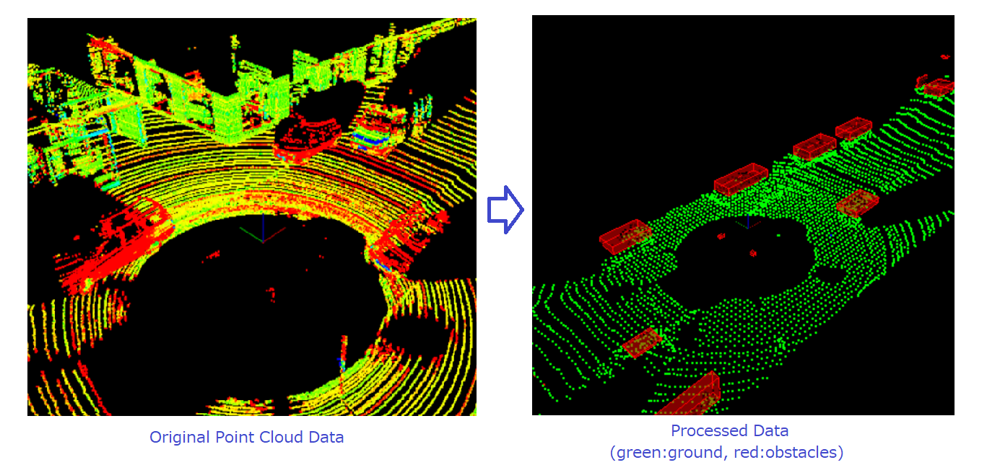

# Lidar-Data Obstacle Detection Excercise

This is an excersice of Lidar data obstacle detection, as a project of Udacity Sensor Fusion Nanodegree. 

## What this is doing? 
- This detects obstacles (ex. cars) on road by processing Lidar point cloud data taken from a car, by doing followings: 

    - Read streaming point cloud data (output of Lidar sensor) 
    - Filter data to decrease data size
        - Down sampling, using Vowxel grid to reduce the data size per region
        - Cropping, to focus on important region (ex. ignoring far side regions)
    - Cluster the point clouds into segements 
        - Segment into "obstacles" and "ground", using RANSAC clustering algorithm
        - Then, further cluster "obstacles" into different objects, using Euclidean clustering algorithm
        - For obstacles clustering, KD-Tree is also used to reduce computation cost
    - (Note) 
        - The performance largely depends on clustering parameters, and they have not been optimized yet
        - Both clustering functions are made from scratch, not using existing PCL functions

## How to Run? 

- Install followings 
    - cMake (for compiling)
    - PCL (Point Cloud Library; www.pointclouds.org)
- Type following commands on terminal
    - mkdir build && cd build
    - cmake .. 
    - make 
    - ./environment 

    
## Environment 
- Tested on Ubuntu 18.04 

